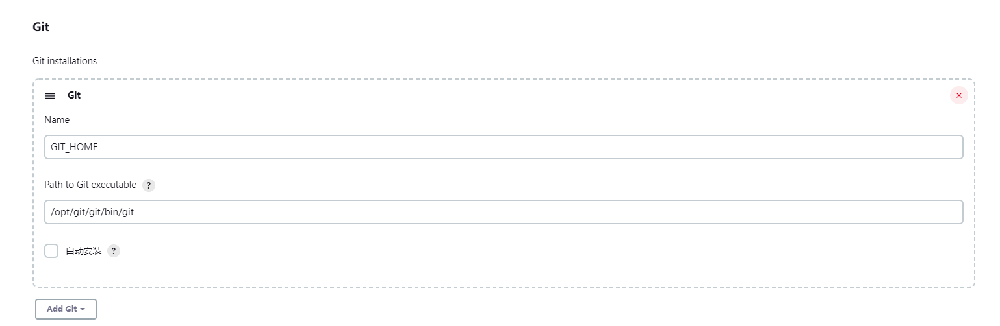

## 安装-linux环境
<https://pkg.jenkins.io/redhat-stable/>安装jenkins和jdk
```js
#查看jenkins可执行文件所在位置
whereis jenkins 
#jenkins工作目录，初始化密码所在位置
cd /root/.jenkins
```

启动jenkins,因为是全局注册了，不推荐直接启动进入窗口模式，会阻塞其他操作。
<https://www.jenkins.io/doc/book/installing/linux/#start-jenkins>
 启动
 ```js
 systemctl start jenkins    启动，启动较慢，可能要等一会。
 systemctl stop jenkins   停止
 systemctl status jenkins  状态
 systemctl enable jenkins  开机自启动
 ```

## 初始化
第一次只能管理员使用，初始化密码位置页面有写。
选择插件来安装。记得安装GIT,NODEJS

## 创建用户


## 需要安装git，使用下载tar包，解压，编译安装。
<https://mirrors.edge.kernel.org/pub/software/scm/git/> 下载最近得版本2.36.1得tar.gz
```js
#解压，新建编译后得包目录
#进入源码包
cd /opt/git/git-2.37.3
./configure --prefix=/opt/git/git
make
make install
```
前往/etc/profile注册全局变量，
vim /etc/profile
export PATH=$PATH:/opt/git/git/bin
source /etc/profile
git --version


## 配置git,node
Manage Jenkins/Global Tool Configuration下


node环境建议使用NODEJS插件动态选择，如果不行，就采用git那样，全局安装到linux，然后选择手动配置path环境变量

## 构建脚本
```js
npm install 
rm -rf ./dist
npm run build:uat
rm -rf /opt/nginx/nginx/html/jas-security-dir/*
cp -rf ./dist/* /opt/nginx/nginx/html/jas-security-dir/

```